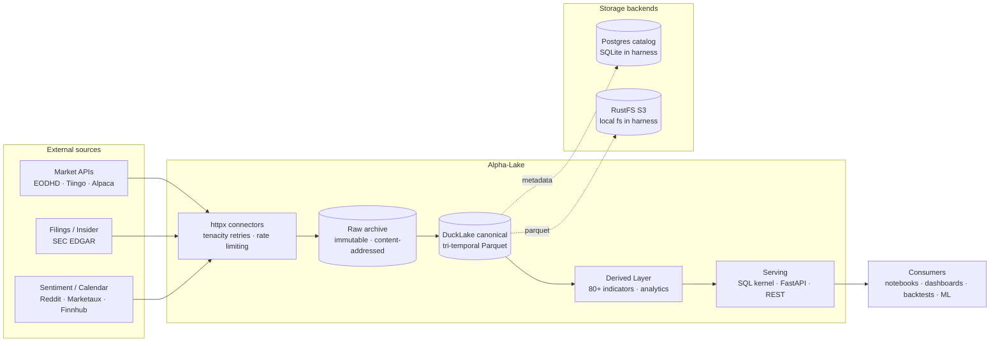

# Alpha-Lake

[](https://github.com/mblaauw/alpha-lake/actions/workflows/ci.yaml)
[](https://github.com/mblaauw/alpha-lake/actions/workflows/release.yaml)
[](https://www.python.org)
[](https://docs.astral.sh/uv/)
[](https://duckdb.org)
[](https://pola.rs)
[](https://fastapi.tiangolo.com)
[](LICENSE)

Stack-first, tri-temporal, replayable **market-data lakehouse** — ingests, archives, validates, and serves point-in-time-correct market facts to notebooks, backtests, dashboards, ML, and trading systems.

> **Owns facts. Serves what was knowable as of a date. Knows nothing about strategy.**

---

## Architecture



**Layers** — Connectors fetch and archive payloads verbatim. The canonical layer parses, validates, and writes tri-temporal datasets. The derived layer computes 80+ technical indicators on top. The serving layer exposes everything through a versioned SQL kernel and REST API.

---

## Key Capabilities

- **Tri-temporal tracking** — valid time, knowledge time, and system time tracked independently on every fact
- **Immutable raw archive** — every API payload is archived before parsing; replay from scratch never requires re-fetching
- **Point-in-time correctness** — every research read requires an explicit `as_of` and returns exactly what was knowable at that instant
- **80+ derived technical indicators** — momentum, volatility, volume, structure, relative performance, and utility indicators with full glossary and dashboard
- **Fundamental metrics** — scale, profitability, growth, financial health, cash flow quality, estimates, events, and read-time valuation metrics from SEC EDGAR filings
- **Self-contained Compose stack** — Postgres catalog, RustFS S3, and the app server all start with `just up`
- **Air-gap capable** — all dependencies vendored; zero network at runtime
- **No strategy semantics** — neutral measurements only; the lake never produces scores, ranks, or trade signals

---

## Lake Watch Dashboard

A real-time data-validation dashboard runs at `http://localhost:8000/` once the stack is up. It shows:

- **Overview** — symbol cards with latest price, change, and sparklines
- **Indicators** — 7 category-filtered tabs (Trend, Momentum, Volatility, Volume, Structure, Relative Performance) with 80+ indicator tiles, pin/unpin, and hover glossary tooltips
- **Fundamentals** — category-grouped fundamental metric cards (Scale, Profitability, Cash Flow Quality, Growth, Financial Health, Estimates, Events, Valuation) with glossary tooltips, symbol selector, and latest toggle
- **Bars** — candlestick chart and OHLCV detail per symbol
- **Sentiment** — leaderboard with honest positive/negative/neutral split
- **PIT playground** — rewind knowledge time and inspect snapshots

---

## Quick Start

```bash
git clone https://github.com/mblaauw/alpha-lake.git && cd alpha-lake
cp .env.example .env              # edit .env with your API keys
just up                           # start Postgres + RustFS + app server
just bootstrap                    # initialize catalog tables
just health                       # verify dataset freshness
# → open http://localhost:8000/   # Lake Watch dashboard

# One-off CLI commands:
docker compose run --rm app ingest --market-bars
docker compose run --rm app compute-indicators
```

### Live Ingestion — API Keys

Copy `.env.example` to `.env` and fill in the keys you need:

| Source | Environment Variable | Required |
|--------|---------------------|----------|
| EODHD | `ALPHA_LAKE_EODHD_API_KEY` | Bars, fundamentals, earnings |
| Tiingo | `ALPHA_LAKE_TIINGO_API_KEY` | Bars, fundamentals |
| Alpaca | `ALPHA_LAKE_ALPACA_API_KEY_ID` + `ALPHA_LAKE_ALPACA_API_SECRET_KEY` | Intraday bars |
| Finnhub | `ALPHA_LAKE_FINNHUB_API_KEY` | News, sentiment, analyst estimates, insider |
| Marketaux | `ALPHA_LAKE_MARKETAUX_API_KEY` | News + entity sentiment |
| FMP | `ALPHA_LAKE_FMP_API_KEY` | Economic calendar, analyst estimates |
| OpenFIGI | `ALPHA_LAKE_OPENFIGI_API_KEY` | Identifier resolution |
| Quiver | `ALPHA_LAKE_QUIVER_API_KEY` | Congressional trades |
| Reddit | `ALPHA_LAKE_REDDIT_API_KEY` | Social discussion posts |
| SEC | `ALPHA_LAKE_SEC_CONTACT_EMAIL` (email, not a key) | EDGAR access compliance |

Sources with configured keys are activated automatically. Missing keys fall back to keyless or disabled modes.

**Keyless sources** (no API key required): StockTwits (sentiment), ApeWisdom (attention metrics), FRED (macro series).

---

## Usage Examples

### CLI

```bash
# Ingest daily bars for all configured symbols
docker compose run --rm app ingest --market-bars

# Compute and store all technical indicators
docker compose run --rm app compute-indicators

# List available datasets
docker compose run --rm app dataset

# Ingest a specific macro series
docker compose run --rm app dataset --dataset macro_series --series-id GDP
```

### REST API

```bash
# Point-in-time bar read (research)
curl 'http://localhost:8000/v1/bars?symbol=AAPL&as_of=2026-06-01T00:00:00Z'

# Latest bars (non-research convenience)
curl 'http://localhost:8000/v1/bars/latest?symbol=AAPL'

# Dashboard summary (all indicators for a symbol)
curl 'http://localhost:8000/v1/dashboard/bars/summary?symbol=AAPL'

# Indicator glossary
curl 'http://localhost:8000/v1/dashboard/indicators/glossary'

# Fundamental metrics (authenticated research)
curl -H 'X-API-Key: al_test_...' 'http://localhost:8000/v1/fundamentals/metrics?symbol=AAPL&as_of=2026-06-25T00:00:00Z'

# Fundamentals glossary (dashboard)
curl 'http://localhost:8000/v1/dashboard/fundamentals/glossary'

# Dashboard fundamentals card
curl 'http://localhost:8000/v1/dashboard/symbol/AAPL/fundamentals?latest=true'

# Catalog health
curl 'http://localhost:8000/v1/health'
```

### Python Reader

```python
from alpha_lake.catalog import connect

with connect() as con:
    df = con.read_bars_asof(
        security_ids=["AAPL"],
        as_of="2026-06-01T00:00:00Z",
    )
    print(df)
```

---

## Datasets & Data Suppliers

| Dataset | Primary Source | Secondary Sources |
|---------|---------------|-------------------|
| OHLCV bars — daily | EODHD / Tiingo EOD | Alpaca |
| OHLCV bars — intraday | Alpaca (deferred) | Tiingo IEX, EODHD |
| Fundamentals | SEC EDGAR Companyfacts | Tiingo, EODHD |
| Insider transactions | SEC EDGAR Forms 3/4/5 | Commercial (future) |
| Earnings calendar | EODHD | — |
| News articles | Tiingo News | Alpaca News, EODHD News |
| Social posts | Reddit API | Tiingo / EODHD enrichment |
| Corporate actions | EODHD / Tiingo splits-dividends | SEC filings (validation) |
| Security master | Alpha-Lake internal | OpenFIGI, EODHD, Tiingo, SEC |
| Macro series | FRED | — |
| Technical indicators | Derived (computed in-lake) | — |

---

## Project Structure

```
src/alpha_lake/
├── connectors/      # httpx + tenacity source clients (16 connectors)
├── raw/             # Immutable content-addressed blob archive
├── canonical/       # Parse, validate, and write tri-temporal facts
├── models/          # Patito schemas (= data model = validator = DDL)
├── derived/         # 80+ technical indicators, event aggregations, breadth
├── serving/         # Python reader contracts + SQL kernel macros
├── transport/       # FastAPI REST endpoints + Lake Watch dashboard SPA
├── kernel/sql/      # Versioned PIT resolution SQL macros
├── catalog/         # DuckLake / Postgres catalog interface
├── storage/         # Blob store abstraction (S3 or local filesystem)
├── flows/           # Pipeline logic — thin shells for CLI and Dagster
├── cli.py           # Typer command-line interface
├── config.py        # Pydantic settings from config/stack.toml
├── calendar_.py     # Pinned trading calendar
├── clock.py         # Clock abstraction for deterministic testing
├── secrets.py       # Secret resolution (env / static)
└── source_registry.py  # Source metadata as data
```

---

## Development

### Prerequisites

- [Docker](https://docker.com) + [Docker Compose](https://docs.docker.com/compose/)
- [just](https://just.systems/man/en/) (command runner)
- [uv](https://docs.astral.sh/uv/) (Python package manager)
- Python 3.13+

### Commands

```bash
just up                   # Start the reference stack
just test                 # Run unit + integration tests (embedded)
just test-integration     # Run live API integration tests (--run-live)
just lint                 # Ruff lint + ty type-check + import-linter
just replay               # Golden replay tests (determinism)
just freeze-fixtures      # Freeze golden replay fixtures
just bootstrap            # Initialize catalog tables
just health               # Verify datasets and connections
just serve                # Start FastAPI server + dashboard on :8000
```

### Workflow

- Every issue requires a PR before closing
- PRs must link to the issue they resolve (e.g. `Closes #N`)
- All PRs must pass `just lint` and the forbidden-tokens gate
- Architecture decisions are recorded as ADRs in `docs/adr/`

### opencode Skills

Project-local skills live in `.opencode/skills/<name>/SKILL.md`. Load the relevant skill before starting work — see `AGENTS.md` for the skill index.

---

## Learn More

| Document | Description |
|----------|-------------|
| [DESIGN.md](docs/DESIGN.md) | Full systems design & implementation reference (v3.1, 812 lines) |
| [serving-api.md](docs/serving-api.md) | Python reader contracts + REST API reference |
| [operations.md](docs/operations.md) | Operations guidance, memory sizing, monitoring thresholds |
| [production.md](docs/production.md) | Production deployment, air-gap, observability |
| [GLOSSARY.md](docs/GLOSSARY.md) | Full indicator and fundamental metric definitions by category |
| [Architecture Decision Records](docs/adr/) | All ADRs with status |

---

## License

Apache 2.0 — see [LICENSE](LICENSE).
