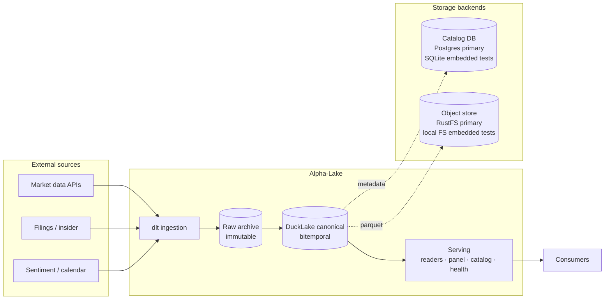
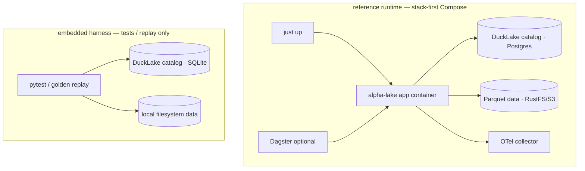
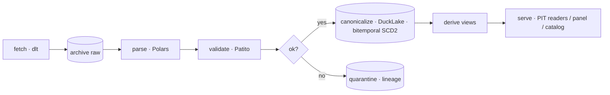
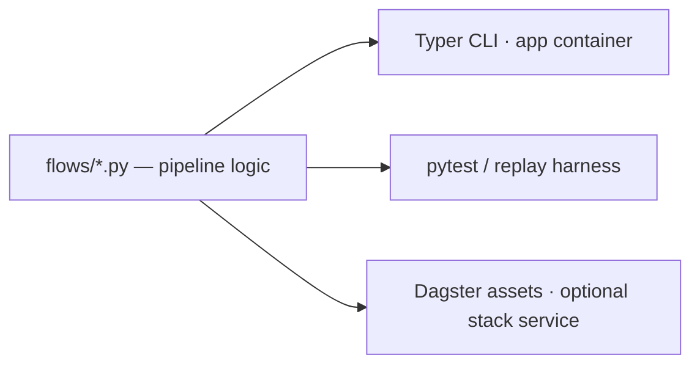
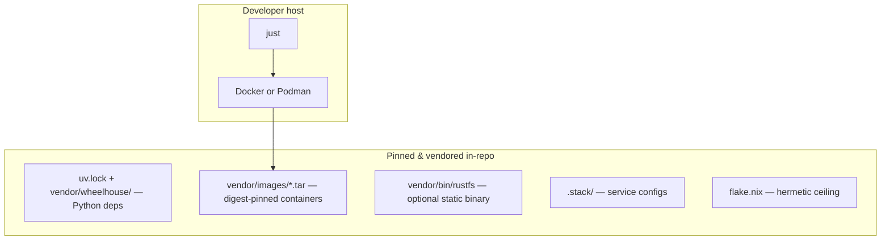
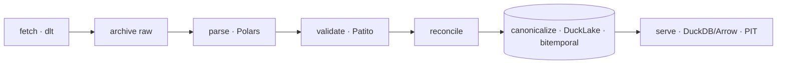

# Alpha-Lake — Systems Design & Implementation Reference (v3.1 — stack-first)

A standalone, bitemporal, replayable **market-data lakehouse**. It ingests, archives, validates, and serves point-in-time-correct market facts to any consumer — notebooks, dashboards, backtests, ML, trading systems — and depends on none of them. It runs **stack-first** in its own self-contained Compose runtime: every dependency is pinned and vendored in-repo. A lightweight embedded mode exists only for fast tests, debugging, fixture generation, and golden replay — not as a separate product path.

> **Owns facts. Serves what was knowable as of a date. Knows nothing about strategy.**

**Current architectural decision:** Alpha-Lake is **stack-first**. The Compose stack is the v0.1 reference runtime. Embedded local execution is retained only for tests, debugging, fixture generation, and golden replay.

### How to read this document

Two registers, one source of truth:

- **Part I — Systems Design** (§0–6): the *what and why*. Architecture, principles, runtime model, the conceptual model. Read this to understand the system.
- **Part II — Implementation Reference** (§7–24): the *how*. Exact schemas, SQL, field specs, pipeline shapes, test specs. Read this to build it.
- **Part III — Governance** (§25–30): invariants, ADRs, build plan, stack, non-goals.

Section cross-references link the two registers (a concept in Part I points to its buildable spec in Part II).

---

# Part I — Systems Design

## 0. Scope

**In scope:** connectors; immutable raw archive; parse → neutral facts; validation + quarantine; security identity; **bitemporal** canonical datasets; corporate-action-aware adjusted *views*; versioning, lineage, time-travel; point-in-time serving; reconciliation; catalog; deterministic replay; data-health.

**Out of scope (v1):** strategy/decision logic; materialized strategy features (§14); intraday streaming; distributed compute; hosted multi-tenant service; ML online feature store; governance UI.

```
Alpha-Lake tells consumers what was knowable at a point in time.
Consumers decide what it means.
```

## 1. Principles

1. **Raw is immutable.** Archive every payload verbatim before parsing; fix bugs by replay, never rewrite. → §8
2. **Canonical is reproducible.** `canonical = f(raw, parser_version, schema_version, config, security_master)`. → §20
3. **Point-in-time correctness > convenience.** No consumer sees future data; every research read is knowledge-time bounded. → §11
4. **Tri-temporal, explicitly.** Valid / knowledge / system time are three clocks; conflating any two is a bug. → §4, §11
5. **Degrade, never corrupt.** Failure → explicit degraded state; bad data → quarantine with lineage. → §13
6. **Facts, not opinions.** Neutral transforms only; the lake never knows if a value is bullish or tradable. → §14
7. **Contracts are the API; layout is not.** Consumers bind to typed models and readers. → §17
8. **Self-contained & reproducible.** The reference runtime is a local Compose stack; all deps are pinned and vendorable. → §22
9. **Stack-first, not laptop-first.** The real catalog/object-store boundary is exercised from day one; embedded mode is only a test/replay harness. → §3, §27

## 2. Architecture

### 2.1 Context & containers



The domain core (`models/`, `ports/`) has no I/O. Adapters implement ports; the serving layer is the only thing consumers import.

### 2.2 Layer rules (CI-enforced by `import-linter`, §16)

| Layer | May import | May not import |
|---|---|---|
| `models/` | stdlib, polars, patito | everything else |
| `ports/` | `models/` | adapters, storage |
| adapters (`connectors`, `canonical`, `quality`, `catalog`, `serving`) | `models/`, `ports/`, `storage/` | orchestration |
| `flows/`, `cli` | all above | — |

## 3. Runtime model & self-containment

Alpha-Lake is **stack-first**. The production-shaped runtime is the default from day one: Postgres catalog, S3-compatible object storage, DuckLake, OpenTelemetry, and optional Dagster. The goal is to exercise the real catalog/object-store boundary immediately, not after the data model is already built around a simplified local filesystem path.

The lightweight embedded path still exists, but only as a **test/debug/golden-replay harness**. It is not a first-class runtime and should not drive architectural decisions.



| | Reference stack | Embedded harness |
|---|---|---|
| Purpose | Normal development, integration, v0.1 validation | Fast tests, debugging, fixture generation, golden replay |
| Runtime | Docker Compose or Podman Compose | In-process Python / DuckDB |
| Catalog | Postgres container | SQLite file |
| Object store | RustFS S3-compatible container/binary | local filesystem |
| Orchestration | Typer CLI in app container; Dagster optional | pytest / replay runner |
| Observability | OTel → collector | OTel → console |
| Command shape | `just up`, `just bootstrap`, `just ingest`, `just health` | `just test`, `just replay` |
| Architectural status | **Primary path** | **Supporting harness only** |

The developer does not install Postgres, RustFS, Dagster, DuckDB extensions, or observability services locally. The only expected host tools are a container runtime, `just`, and optionally `uv` for local editing. The stack is started and stopped as one isolated namespace.

## 4. The temporal model (conceptual)

Three clocks, tracked independently. Buildable mechanics in §11.

```
valid time     effective_date   when the fact is true in the market
knowledge time available_at     when the lake could first serve it   ← the PIT boundary
system time    DuckLake snapshot when the lake physically committed   (audit / rollback)
```

- **`as_of` is a query parameter, never a stored column.** Only `available_at` governs visibility.
- **System time ≠ knowledge time.** They coincide at first ingest but diverge on backfill/replay. `available_at` is a stored domain fact; DuckLake snapshots are audit/reproducibility — never the PIT boundary.
- **Restatements are versions, not overwrites.** A correction mints a new `available_at` version; prior versions are retained.

## 5. Domain model overview

The lake's models describe **facts**; it never holds decisions. → full schemas §9.

| Fact entities (lake) | Forbidden here (consumer-owned) |
|---|---|---|
| `Security`, `BarFact`, `FundamentalFact`, `InsiderTransactionFact`, `MentionFact`, `NewsFact`, `CorporateActionFact`, `EarningsEventFact`, `DataQualityEvent`, `DatasetVersion` | scores, ranks, signals, positions, fills, decisions, risk actions, journals |

**Eligibility test for anything the lake exposes** (§14): *its definition would be byte-identical for two consumers who completely disagree about market direction.*

## 6. Component flow



Each stage maps to a Part II section: fetch §7–8, parse/validate §13, canonicalize §9/§11/§16, derive §14, serve §17.

---

# Part II — Implementation Reference

## 7. Source registry (Zone 0)

All source behavior is data, not code. One row per source drives connectors, precedence, freshness, and reconciliation.

```
source_id            stable id (e.g. "eodhd")
source_name          human label
source_type          rest | html | file
auth_type            api_key | oauth | none
api_key_env          env var name for the secret (never the secret)
rate_limit_per_min   token-bucket budget
cadence              daily | weekly | on_demand
freshness_sla_days   max acceptable staleness (drives §13)
retry_policy         max_attempts, backoff, jitter
parser_version       current parser id
contract_version     dataset contract id served
source_priority      lower = higher precedence (drives §11 stage 2)
owner                accountable name
enabled              bool
```

### Data suppliers (per-dataset)

| Dataset | Primary Source | Secondary Source(s) |
|---------|---------------|---------------------|
| OHLCV bars — daily | EODHD or Tiingo EOD | Alpaca |
| OHLCV bars — intraday | Alpaca (deferred) | Tiingo IEX, EODHD |
| Fundamentals | SEC EDGAR Companyfacts | Tiingo, EODHD |
| Insider transactions | SEC EDGAR Forms 3/4/5 | commercial (future) |
| Earnings calendar | EODHD | — |
| News articles | Tiingo News | Alpaca News, EODHD News |
| Social mentions | Reddit API | Tiingo/EODHD enrichment |
| Corporate actions | EODHD or Tiingo splits-dividends | SEC filings (validation) |
| Security master | Alpha-Lake internal | OpenFIGI, EODHD, Tiingo, SEC |

Each connector is modeled as one issue per (dataset, supplier) pair on the project board. See the [Alpha-Lake Project Board](https://github.com/users/mblaauw/projects/4) for the full issue breakdown.

## 8. Connectors & raw archive

**Connectors** (dlt sources + custom `httpx`/`tenacity` resources) build requests, enforce rate limits, apply retry, archive the raw response **before any parse**, emit fetch events, return fetch metadata. They must not interpret, write canonical, or hide partial failure.

**Raw archive** — immutable, content-addressed:

```
raw/source={id}/endpoint={ep}/year={yyyy}/month={mm}/day={dd}/{fetch_id}.zst
```

**Manifest row** (one per fetch):

```
fetch_id                sha256(source|endpoint|params|ingest_ts)[:16]
source_id  endpoint
request_params_hash     pinned canonicalization (sorted keys, normalized types)
request_params_json
ingest_ts  http_status
content_hash            sha256 of raw bytes — the idempotency key
content_type  byte_size
parser_version_intended
vault_path
```

**Idempotency (I9):** re-fetch with identical `content_hash` is a no-op; a changed hash mints a new canonical version. Nothing in the archive is ever rewritten or deleted (I1).

## 9. Canonical data model

Parquet tables managed by DuckLake. Every canonical row carries the **temporal columns** + the **lineage columns**.

**Temporal columns (every dataset):**

```
effective_date     valid time
available_at        knowledge time (PIT boundary)
source_published_at source's stated publish time (nullable)
ingested_at         raw fetch time
validated_at        passed-validation time
```

**Lineage columns (every dataset):**

```
security_id  source_id  schema_version  parser_version
source_fetch_id  raw_payload_hash  ingestion_run_id  content_hash  quality_status
```

**Per-dataset business fields & keys:**

| Dataset | Business fields | Natural key | Version identity |
|---|---|---|---|
| `bars` | open, high, low, close, volume (**raw only**) | `security_id + effective_date + source_id` | natural + `available_at + content_hash` |
| `fundamentals` | fiscal_period, statement_type, line_item, value, currency | `… + fiscal_period + statement_type + line_item + source_id` | natural + `available_at + content_hash + parser_version` |
| `insider_tx` | filer_cik, issuer_cik, transaction_code, shares, price, value | `filer_cik + issuer_cik + transaction_date + transaction_code + shares + price + source_id` | natural + `available_at + content_hash` |
| `corp_actions` | action_type, ratio/amount, ex_date | `security_id + action_type + effective_date + source_id` | natural + `available_at + content_hash` |
| `news` | article_id, title, description, url, published_date, source_name, relevance_score, sentiment_score | `article_id + source_id` | natural + `available_at + content_hash` |
| `mentions` | venue, count | `security_id + source_id + venue + effective_date` | natural + `available_at + content_hash` |
| `earnings_calendar` | report_date, session | `security_id + report_date + source_id` | natural + `available_at + content_hash` |

**Raw-only bars rule:** adjusted prices are *views* (§12), never stored facts; `price_mode` is a serve parameter, never part of identity.

**Hash canonicalization:** any fallback hash (e.g. insider `normalized_hash` when CIK is absent) uses a pinned recipe — sorted keys, normalized numeric precision, normalized dates, stable null handling, `normalization_version` — or idempotency breaks across parser versions.

## 10. Security master & resolution

`symbol` is unstable (rename/reuse); `security_id` is canonical from row one.

**Model:**

```
security_id  symbol  exchange  name  cik  figi  isin  currency
valid_from  valid_to  status  source_id  available_at
```

**Point-in-time resolution** (itself bitemporal — cannot leak a future rename):

```sql
SELECT security_id FROM security_master
WHERE symbol = :symbol AND exchange = :exchange
  AND valid_from <= :as_of AND (valid_to IS NULL OR valid_to > :as_of)
  AND available_at <= :as_of
QUALIFY row_number() OVER (ORDER BY available_at DESC) = 1;
```

Canonical datasets are keyed by `security_id`; `symbol` is resolved only at the API edge (§17) for caller convenience.

## 11. The point-in-time read (mechanics)

Every research read applies `effective_date <= :as_of AND available_at <= :as_of`, then resolves to one value in **two stages**: newest knowledge-time version per source, then source precedence.

```sql
WITH versioned AS (                              -- stage 1: newest version per (fact, source)
  SELECT *, row_number() OVER (
            PARTITION BY security_id, effective_date, source_id
            ORDER BY available_at DESC, content_hash) AS v_rn
  FROM bars
  WHERE security_id = :sid
    AND effective_date BETWEEN :start AND :end
    AND available_at <= :as_of)
SELECT * EXCLUDE (v_rn, s_rn) FROM (             -- stage 2: collapse sources by precedence
  SELECT *, row_number() OVER (
            PARTITION BY security_id, effective_date
            ORDER BY source_priority ASC) AS s_rn
  FROM versioned WHERE v_rn = 1)
WHERE s_rn = 1;
```

Stage 1 alone returns one row per source; stage 2 yields the single canonical answer. `source_priority` is registry data (§7).

**Restatement (worked example):**

```
security_id | effective_date | close  | available_at         | content_hash
AAPL-7f3a   | 2026-06-01     | 195.10 | 2026-06-02T07:00:00Z | a1…
AAPL-7f3a   | 2026-06-01     | 195.23 | 2026-06-10T07:00:00Z | b2…
```
`as_of=2026-06-05 ⇒ 195.10` · `as_of=2026-06-17 ⇒ 195.23`. Overwriting violates I4.

**Backfill:** a bar for `2024-01-05` ingested on `2026-06-17` gets `available_at=2026-06-17`. `as_of=2024-01-06` cannot see it; `as_of=2026-06-17` can. Backfills improve current knowledge; they never rewrite what was historically knowable.

**No-latest-by-default (I12):** research readers require `as_of`; the default is a loud sentinel, not `None` — a separately named `latest_*` path is the only route to unbounded reads.

## 12. Corporate actions & adjusted views

Store raw facts; serve adjusted views computed from only the actions **knowable at `as_of`**.

**Adjustment rule:** for `price_mode=split_adjusted, as_of=A`, apply only
`corp_action WHERE effective_date <= A AND available_at <= A`.

**Required leakage test (one of the most important):**

```
raw price 2025-01-01; split effective 2025-06-01; split available_at 2025-06-02
  as_of 2025-05-30 ⇒ split NOT applied
  as_of 2025-06-03 ⇒ split MAY be applied
```

`price_mode ∈ {raw, split_adjusted, total_return_adjusted}`. Dividends are recorded; cash dividends do not restructure the raw OHLCV series. Adjustment is a pure function over the PIT action set.

## 13. Validation, quarantine, reconciliation

**Validation = Patito** (Polars-native pydantic): the fact model *is* the schema *is* the validator. Checks run on exit from normalize, before canonical write.

**Categories:**

- *Structural* — required fields, parseable types, valid enums/dates, non-empty PK.
- *Market sanity* — no zero/negative price; no impossible OHLC (`low ≤ open,close ≤ high`); `|return| > tol` requires a corp-action record; non-negative volume; deterministic dedup.
- *Freshness (per-dataset SLA)*:

  | Dataset | SLA |
  |---|---|
  | bars | available by next trading day |
  | earnings_calendar | ≤ 7d |
  | fundamentals | ≤ 30d (or source-specific) |
  | insider_tx | ≤ 3 trading days |
  | mentions | ≤ 1d |
  | security_master | ≤ 7d |

- *Point-in-time* — no research read defaults to "latest".

**Failure levels:** `SOURCE_DEGRADED` (continue) · `DATA_QUARANTINED` (rows rejected, dataset continues) · `DATA_STALE` (SLA violated) · `DATA_HALT` (consumer-blocking, e.g. stale prices) · `SOFTWARE_HALT` (impossible state).

**Quarantine envelope** (a first-class product; every rejected row is replayable, no orphans — I11):

```
quarantine_id  dataset  reason_code  severity
security_id  source_id  effective_date  available_at
fetch_id  raw_payload_hash  parser_version  schema_version
record_payload  created_at  repair_status
```

**Reconciliation ≠ quarantine (I10).** A valid *primary* is never quarantined because a *secondary* disagrees. Quarantine = intrinsic defects (negative price, `high<low`, bad date, missing PK). Cross-source disagreement emits:

```
ReconciliationDisagreement{
  dataset  security_id  effective_date
  primary_source_id  secondary_source_id  field
  primary_value  secondary_value  difference  tolerance  severity  available_at }
```

## 14. Derived transform library (no materialized features)

The lake materializes **no** strategy-windowed features (`ema_50`, `atr_14`, …) — windows are strategy choices. It provides clean PIT bars, adjusted views, corp-action sets, security master, calendar, and a **pure parameterized transform library** (Python functions + DuckDB/SQLMesh macros) consumers compose.

```python
# served by the lake (neutral):
ema(close, window);  atr(high, low, close, window);  rolling_volume(volume, window)
# NOT served (strategy semantics): trend_score, risk_on, candidate_rank
```

## 15. Storage — DuckLake + RustFS

**DuckLake 1.0**: open Parquet data + all metadata in a SQL catalog; ACID, time-travel snapshots, schema evolution as catalog transactions.

The **reference attach path is stack-first**: Postgres catalog + RustFS data over S3. The SQLite/local-FS attach path is kept only for embedded tests and golden replay.

```python
# attach (reference stack) — Postgres catalog + RustFS data over S3
ATTACH 'ducklake:postgres:host=pg dbname=lake_catalog' AS lake
       (DATA_PATH 's3://lake/');
SET s3_endpoint='rustfs:9000'; SET s3_url_style='path'; SET s3_use_ssl=false;

# attach (embedded harness only) — tests / replay / debugging
ATTACH 'ducklake:sqlite:data/lake.catalog' AS lake (DATA_PATH 'data/lake/');
```

**RustFS** (object store): Apache-2.0, S3-compatible drop-in, single static binary, no external DB, built-in console. DuckLake writes Parquet over S3; DuckDB `httpfs` targets the RustFS endpoint.

> **Maturity:** RustFS is Beta (GA mid-2026); distributed mode not yet GA — run **single-node** in the reference stack. The embedded harness avoids object storage entirely by using local filesystem fixtures. The lake binds to the S3 *interface*, not to RustFS — SeaweedFS/Garage are endpoint-swap fallbacks.

**Tri-temporal mapping:** valid + knowledge time are *columns*; system time is the *DuckLake snapshot* — one snapshot per ingestion run, tagged `ingestion_run_id`, giving audit trail + pinnable reproducibility (§20).

**Schema evolution:** additive (nullable columns) within a major via DuckLake; required-field/meaning/PK changes mint a new major (`bars.v2` coexists with `v1`); consumers declare supported versions.

## 16. Ingestion pipeline — dlt

```python
@dlt.source
def eodhd():
    @dlt.resource(write_disposition="merge", primary_key=BARS_NATURAL_KEY)
    def bars(): ...     # rest_api/httpx → yields Polars/Arrow

# flow: extract → archive raw (pre-parse) → Polars normalize → Patito validate
#       → DuckLake SCD2 write on knowledge time → snapshot tagged ingestion_run_id
```

**SCD2 mapping:** dlt's SCD2 provides the versioning machinery; the bitemporal write keeps `effective_date` as a dimension and uses **`available_at` as the SCD2 validity axis**. The canonical write is an explicit, tested step on top of dlt — not fully delegated. **Schema contracts:** `freeze` on canonical (new fields require a version bump), `evolve` only in raw/staging.

## 17. Serving API

```python
lake = MarketLake.open(config)

# readers — research readers REQUIRE as_of
bars = lake.bars(symbol="META", start=d1, end=d2, as_of=A, price_mode="split_adjusted")
fund = lake.fundamentals(symbol="AAPL", as_of=A)

# as-of panel — scalar as_of (whole panel as known at one instant)
panel = lake.panel(securities=[...], fields=["close","volume"], start=d1, end=d2, as_of=A)

# spine join — each row carries its own as_of (true point-in-time join, leakage-free)
panel = lake.asof_panel(spine=dates_df,            # (security_id, decision_date)
                        fields=["close","fund.debt_to_equity"], as_of_col="decision_date")

# catalog (control plane) + health
lake.catalog.datasets(); lake.health(as_of=A)
```

Readers return typed models / Arrow tables. **Catalog** answers *what exists + is it trustworthy* (schema version, freshness, row/quarantine/reconciliation counts, dataset versions = DuckLake snapshots, lineage) from the DuckLake catalog DB — no separate metadata service. **Remote (deferred):** Arrow Flight SQL / ADBC (zero-copy, not REST); DuckLake read-only HTTPS share for simple cases.

## 18. Orchestration — flow functions, thin shells

Pipeline logic lives once in `flows/`. Shells wrap the same flow functions with no duplicated logic. The **Typer CLI inside the app container is the first operational shell** because it is the simplest way to prove the vertical slice against the real stack. Dagster is added after the core ingestion and PIT reader are correct.



**CLI surface:** `bootstrap · ingest · validate · backfill · gap-fill · reparse · rebuild · replay · health · catalog · freeze-fixtures · compact`.

**Reference execution:** `just up` starts Postgres + RustFS + the app container; `just ingest ...` executes the CLI in the app container against the real stack.

**Dagster (optional stack service):** each dataset becomes a **partitioned asset** (date partitions = backfill UX); **asset checks** wrap the Patito gates; dlt's Dagster integration drives extraction. SQLMesh is the optional endstate for a growing derived layer; v1 uses DuckDB views. Dagster is a shell over `flows/`, not the owner of business logic.

## 19. Observability — OpenTelemetry

One SDK for logs + metrics + traces; exporters: **OTLP → collector** in the reference stack and **console** in the embedded harness. Spans wrap each flow/asset. Metrics: `ingestion_runs, fetch_{ok,fail}`, `source_latency`, `rows_written`, `quarantine_count`, `reconciliation_count`, `freshness_lag`, `snapshot_count`, `replay_duration`. Health per dataset: `latest_effective_date`, `latest_available_at`, `freshness_status`, `row_count`, `quarantine_count`, `source_status`, `blocking_reason`.

## 20. Determinism & replay

**Contract:** `canonical = f(raw, parser_version, schema_version, config, security_master_snapshot)`. **Replay/rebuild use the recorded `available_at` from the manifest, never wall-clock** (I7) — else re-ingest is nondeterministic.

**Pinned reproducibility:** a consumer pins a DuckLake snapshot (`ingestion_run_id`) + `fixture_version` to reproduce an exact historical view.

**Fixture bundle** (`freeze-fixtures`) freezes: raw payloads · canonical rows · `available_at` values · dataset versions · security-master snapshot · corporate actions · schema/parser versions · content hashes · quarantine + reconciliation events.

**Golden replay** compares **both** business output **and** bitemporal row visibility — a replay that drops knowledge time is not point-in-time faithful.

## 21. Configuration & secrets

Configuration is explicit about runtime shape. `stack` is the default; `embedded` is accepted only for tests, replay, and debugging.

```toml
[lake]
runtime   = "stack"                                # stack | embedded
catalog   = "ducklake:postgres:host=pg dbname=lake_catalog"
data_path = "s3://lake/"

[s3]
endpoint  = "rustfs:9000"
url_style = "path"
use_ssl   = false

[sources.eodhd]
enabled = true
api_key_env = "ALPHA_LAKE_EODHD_API_KEY"
rate_limit_per_minute = 60
source_priority = 10

[quality.bars]
max_staleness_days = 2
halt_on_stale_prices = true
```

Embedded harness override:

```toml
[lake]
runtime   = "embedded"
catalog   = "ducklake:sqlite:data/lake.catalog"
data_path = "data/lake/"
```

Secrets via env or git-ignored local config — **never** written to raw, canonical, manifests, events, fixtures, snapshots. Connector logs redact `api_key/token/secret/authorization/cookie`.

## 22. Self-containment, Compose runtime & vendoring

The repo runs end-to-end with no external service or network. The reference runtime is a local **Docker Compose / Podman Compose** stack; Kubernetes is a future deployment target, not the v0.1 development substrate.



- **Python:** `uv.lock` committed; `uv export` → `vendor/wheelhouse/` for offline `uv sync --offline` inside the app image or embedded harness.
- **App container:** the Alpha-Lake CLI runs inside a pinned app image so developers do not install Postgres, RustFS, DuckDB extensions, or service dependencies on the host.
- **Services:** `compose.yaml` pins **image digests** for Postgres, RustFS, the Alpha-Lake app, and optional Dagster/OTel collector. `just vendor` runs `docker save`/`podman save` into `vendor/images/` for air-gap transfer + load into an internal registry. RustFS may instead be the vendored static binary in `vendor/bin/`.
- **Hermetic option:** `flake.nix` pins Python, RustFS, Postgres, DuckDB, and CLI tooling together (`nix develop` / `nix run`). Maximal reproducibility; Compose + uv remains the pragmatic default.

**Air-gapped workflow:** `just vendor` (online) → copy `vendor/` → `just up --offline` (air-gapped). Nothing reaches the internet at run time.

**Core `just` recipes:** `up · down · reset · logs · bootstrap · ingest · health · vendor · test · replay`. The old idea of `solo` as a primary command is replaced by explicit `test` and `replay` harness commands.

## 23. Repo layout

```
alpha-lake/
├── pyproject.toml  uv.lock  flake.nix  justfile
├── compose.yaml  Dockerfile                            # reference stack runtime
├── config/
│   ├── stack.toml                                      # Postgres + RustFS default
│   ├── embedded.toml                                   # tests / replay only
│   └── config-schema.json
├── contracts/                                          # dataset contract YAML
├── vendor/{wheelhouse,images,bin}/                     # offline deps
├── .stack/{rustfs,postgres,dagster,otel}/              # pinned service configs
├── src/alpha_lake/
│   ├── models/ ports/                                  # pure core
│   ├── connectors/ raw/ normalize/ quality/ canonical/ # ingest path
│   ├── security_master/ corp_actions/ derived/         # facts
│   ├── catalog/ storage/ serving/ replay/ fixtures/
│   ├── flows/                                           # pipeline logic (truth)
│   ├── obs.py  config.py  cli.py                        # OTel · settings · Typer
│   └── assets.py                                        # Dagster (thin over flows)
└── tests/{unit,integration,contract,replay,boundary}/
```

## 24. CI, contracts, versioning

**Dataset contracts:** `contracts/<name>.vN.yaml` — PK, partition key, required/nullable fields, point-in-time columns, freshness SLA, allowed quality statuses, backward-compat rules. CI validates live data against the contract.

**Required checks:** ruff · ty · unit · connector-contract (recorded fixtures) · golden replay (raw→canonical hash) · bitemporal-visibility · adjusted-price leakage · `security_id` resolution · idempotency/duplicate · fixture-hash stability · `import-linter` boundary (incl. no-strategy rule).

**SemVer ↔ schema:** a breaking schema major forces a package major; consumers pin a range. **Distribution (air-gapped):** publish wheels to an internal index/mirror or vendor a pinned wheel; `uv build` yields a self-contained wheel.

---

# Part III — Governance

## 25. System invariants

- **I1** Raw payloads, manifests, fixtures are immutable.
- **I2** Every canonical row carries lineage + maps to a DuckLake snapshot.
- **I3** No strategy/decision semantics anywhere (no scores, ranks, flags).
- **I4** Corrections are new `available_at` versions, never overwrites.
- **I5** No research read returns `available_at > as_of` or `effective_date > as_of`.
- **I6** Adjusted views apply only corp actions known at `as_of`.
- **I7** Replay is deterministic; uses recorded `available_at`, never wall-clock.
- **I8** Canonical keyed by `security_id`; `symbol` resolved point-in-time.
- **I9** Same content hash ⇒ idempotent; new hash ⇒ new version.
- **I10** A reconciliation disagreement never halts a valid primary.
- **I11** Quarantined rows retain full raw-archive traceability.
- **I12** Serving exposes no "latest" default to research callers.
- **I13** The repo runs end-to-end offline from vendored dependencies.
- **I14** The reference runtime is stack-first Compose; embedded mode is only for tests, debugging, fixture generation, and golden replay.

## 26. ADR log

```
0001 DuckLake as table format + catalog (Parquet data, SQL-catalog metadata)
0002 Postgres catalog as reference path; SQLite only for embedded replay/tests
0003 RustFS (Apache-2.0, single binary) as S3 object store; single-node until GA
0004 Tri-temporal model: valid+knowledge as columns, system time as snapshots
0005 security_id (security master) as canonical key from v1
0006 Raw-only bars; adjustment as read-time, PIT-bounded view
0007 dlt + SCD2 for ingestion; raw archived before normalize
0008 Polars + Patito: unified model/schema/validator
0009 Fact store + transform library, never a feature store
0010 Flow functions; Typer app-container CLI first, Dagster optional shell later
0011 OpenTelemetry: OTLP collector in stack, console exporter in embedded harness
0012 Stack-first Compose reference runtime; all deps vendored in-repo
0013 Nix flake as the hermetic reproducibility ceiling
0014 Source registry as data; precedence/freshness/retry not hardcoded
0015 Embedded mode demoted to test/debug/fixture/golden-replay harness
0016 Kubernetes is a future deployment target, not the v0.1 development substrate
```

## 27. Build plan (from scratch, stack-first, vertical-slice, oracle-gated)

Each phase ships only when the golden replay hash is stable and boundary tests are green. The hardest integration risks — DuckLake + Postgres catalog + S3/RustFS object storage + app-container execution — are exercised immediately.

- **Phase 0 — stack skeleton.** Compose stack with Postgres catalog, RustFS object store, Alpha-Lake app container, config loading, DuckLake attach, `models/` + `ports/`, import-linter, OTel collector, `just up/down/health`. No dataset work is accepted until the real stack can boot and pass a health check.
- **Phase 1 — bars vertical slice against the real stack.** dlt source → raw archive on RustFS → Polars parse → Patito `BarFact` → SCD2 bitemporal write to DuckLake/Postgres catalog → PIT reader. Prove restatement (§11), leakage (§12), idempotency, and visibility tests. This single slice exercises every hard part.
- **Phase 1b — embedded replay harness.** Add SQLite/local-FS only for pytest, fixture generation, golden replay, and debugging. This harness must prove equivalence with the stack path for frozen fixtures, but it must not become a separate runtime architecture.
- **Phase 2 — identity & actions.** security master (§10) + corporate actions + adjusted views (bars adjustment depends on them), still running through the reference stack.
- **Phase 3 — remaining datasets.** fundamentals → insider → mentions → earnings_calendar, each repeating the Phase-1 vertical pattern.
- **Phase 4 — serving surface.** as-of panel / spine join; catalog; health; explicit `latest_*` non-research paths where needed.
- **Phase 5 — orchestration hardening.** Add Dagster assets over the already-proven `flows/`; asset checks wrap Patito gates; date partitions improve backfill UX. Dagster is not allowed to own business logic.
- **Phase 6 — packaging and air-gap.** Digest-pinned images, `vendor/images`, `vendor/wheelhouse`, optional `vendor/bin/rustfs`, offline `just up --offline`, fixture bundles, and reproducibility docs.
- **Phase 7 — hardening.** dataset contracts + schema versioning; SQLMesh derived layer; Arrow Flight/ADBC serving; Kubernetes deployment target; RustFS clustering only when GA and genuinely needed.

## 28. Tech stack

| Concern | Choice |
|---|---|
| Language / packaging | Python 3.14 · uv (lockfile + offline wheelhouse) |
| Reference runtime | Docker Compose / Podman Compose, driven by `just` |
| Lakehouse | DuckLake 1.0 (Parquet + SQL catalog) |
| Catalog DB | PostgreSQL reference path; SQLite embedded harness only |
| Object store | RustFS S3-compatible reference path; local FS embedded harness only |
| Engine | DuckDB |
| Ingestion | dlt (incremental, SCD2, contracts, REST toolkit) |
| Dataframes + models + validation | Polars + Patito |
| Transform | DuckDB SQL ▸ SQLMesh |
| Orchestration | Typer CLI in app container first; Dagster optional over `flows/` |
| Observability | OpenTelemetry (OTLP collector in stack; console in embedded harness) |
| Remote serving | Arrow Flight SQL / ADBC (deferred) |
| Lint/format · types · tests · boundaries | ruff · ty · pytest · import-linter |

One dataframe lib (Polars), one SQL engine (DuckDB) — never both for the same job; they share Arrow. All dependencies open-source; no managed service required. Kubernetes remains a later deployment target, not a v0.1 design dependency.

## 29. Non-goals (v1)

Strategy logic; materialized features; intraday/streaming; distributed compute; hosted multi-tenant service; ML online feature store; governance UI; Kubernetes platformization; RustFS clustering. Design the seams (object storage, Postgres catalog, Flight serving, Dagster/SQLMesh, Kubernetes deployment, clustering); do not build the distributed platform in v1.

## 30. Summary



The lake owns bitemporal, source-aware, replayable facts. Consumers own interpretation. It installs nothing it doesn't carry, and it runs stack-first in its own self-contained Compose space. The embedded path exists only to make tests, fixtures, and golden replay fast and deterministic.
